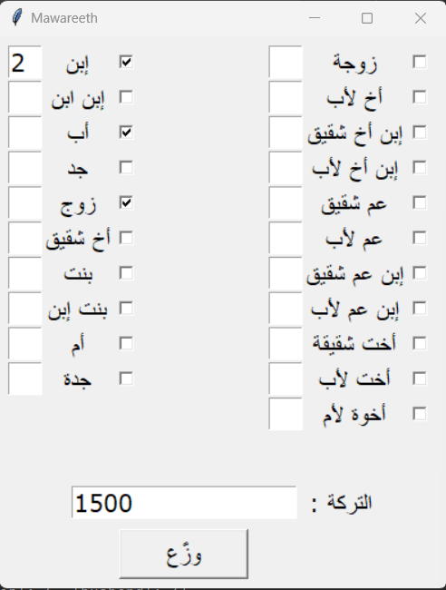
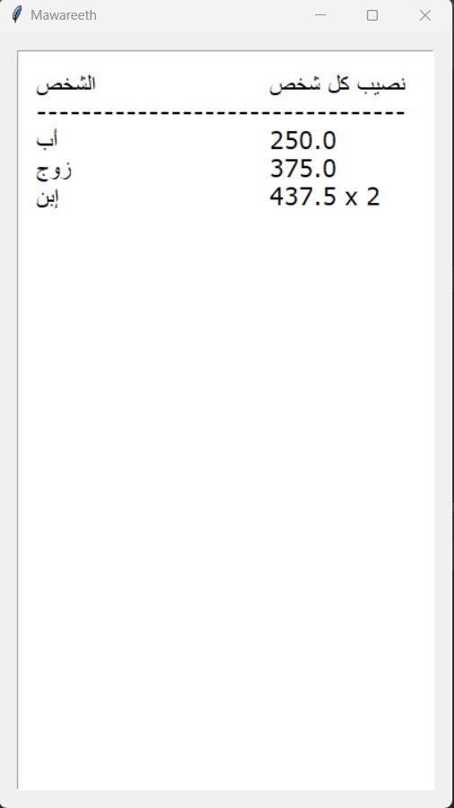

# Mawareeth
It is a python GUI application for calculation the portion of every heir according to the doctrine of **MY RELIGION ISLAM**.

# Operation
Open the app from the gui.py file.

# Samples
Check the checkbox on the right side of every heir you want to give a portion and enter the number on the textbox on the left side if the heir is more than one except some heirs you can't give a number such as father or grand-father.

Then enter the heritage on the textbox shown on the bottom and click on the button under it to see the results.

